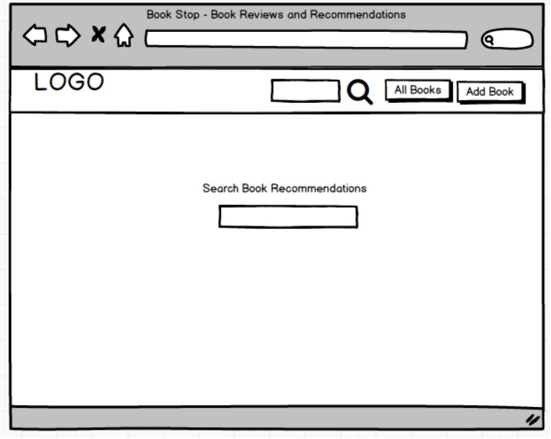
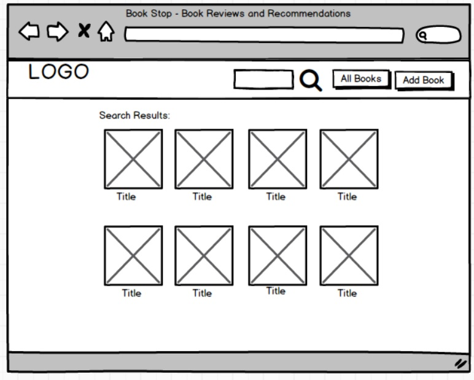
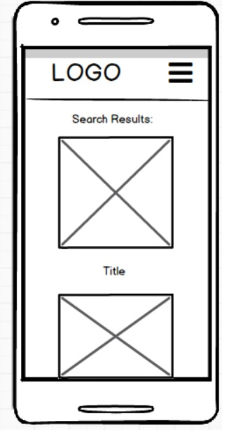

# Data Centric Development Project

This project is an online website for book recommendations and reviews. The goal was to make a site with backend database functionality using MongoDB. The site that it is built on should allow users to modify the database by creating, updating, deleting as well as reading from it.

This is the third project as part of my [Code Institute](https://codeinstitute.net/) online diploma course.

---

## User Experience Design

### User Stories

These are potential actions that users of the website would want to perform. 

* As a user, I 
* As a user, I
* As a user, I

---

### Wireframes

